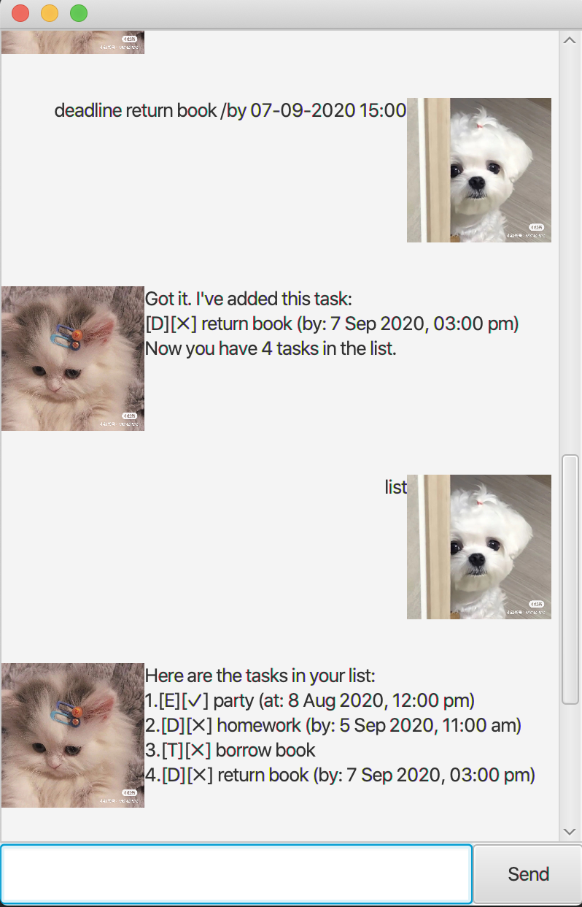

# User Guide for Duke

## Features

### Feature 1 - Add tasks

Add tasks to keep track of your schedule!
The supported tasks include:

- Todo
- Event
- Deadline

### Feature 2 - Complete tasks

Marks a task as complete once you have done it.

### Feature 3 - Delete tasks

Deletes an unwanted task.

### Feature 4 - Find tasks

Finds tasks related to the keyword given.

### Feature 5 - Update tasks

Edit a task's description/date if necessary.

## Usage

### `todo` - Adds a todo task
Format: `todo [description]`

Example of usage: `todo borrow book`

Expected outcome:
```
Got it. I have added this task: \n[T][✗] borrow book \nNow you have 1 tasks in the list.
```

### `event` - Adds an event task
Format: `event [description] /by [dd-mm-yyyy hh:mm]`

Example of usage: `event party /at 06-08-2020 17:00`

Expected outcome:
```
Got it. I have added this task: \n[E][✗] party (at: 6 Aug 2020, 05:00 pm) \nNow you have 2 tasks in the list.
```

### `deadline` - Adds a deadline task
Format: `deadline [description] /by [dd-mm-yyyy hh:mm]`

Example of usage: `deadline return book /by 06-06-2020 12:00`

Expected outcome:
```
Got it. I have added this task: \n[D][✗] return book (by: 6 Jun 2020, 12:00 pm)\nNow you have 3 tasks in the list.
```

### `list` - List all the tasks available

Example of usage: `list`

Expected outcome:
```
Here are the tasks in your list: \n1.[T][✗] borrow book \n2. [E][✗] party (at: 6 Aug 2020, 05:00 pm) \n3.[D][✗] return book (by: 6 Jun 2020, 12:00 pm)
```

### `done` - Marks a task as complete
Format: `done [index]`

Example of usage: `done 3`

Expected outcome:
```
Nice! I've marked this task as done: \n[D][✓] return book (by: 6 Jun 2020, 12:00 pm)
```

### `delete` - Deletes a task
Format: `delete [index]`

Example of usage: `delete 2`

Expected outcome:
```
Noted. I've removed this task: \n[E][✗] party (at: 6 Aug 2020, 05:00 pm) \nNow you have 2 tasks in the list
```

### `find` - Finds tasks related to the keyword
Format: `find [keyword]`

Example of usage: `find book`

Expected outcome:
```
Here are the matching tasks in your list: \n1. [T][✗] borrow book \n2. [D][✓] return book (by: 6 Jun 2020, 12:00 pm)
```

### `update` - Updates a task
Format: `update [index] /desc [new description]`

Example of usage: `update 1 /desc buy book`

Expected outcome:
```
Noted. I've updated this task: \n[T][✗] buy book \nNow you have 2 tasks in the list
```

Format: `update [index] /date [new date]`

Example of usage: `update 2 /date 09-09-2020 12:00`

Expected outcome:
```
Noted. I've updated this task: \n[D][✓] return book (by: 9 Sep 2020, 12:00 pm) \nNow you have 2 tasks in the list
```

### `exit` - Exits the chatbot
Example of usage: `bye`

Expected outcome:
```
Bye! Hope to see you again soon!
```
